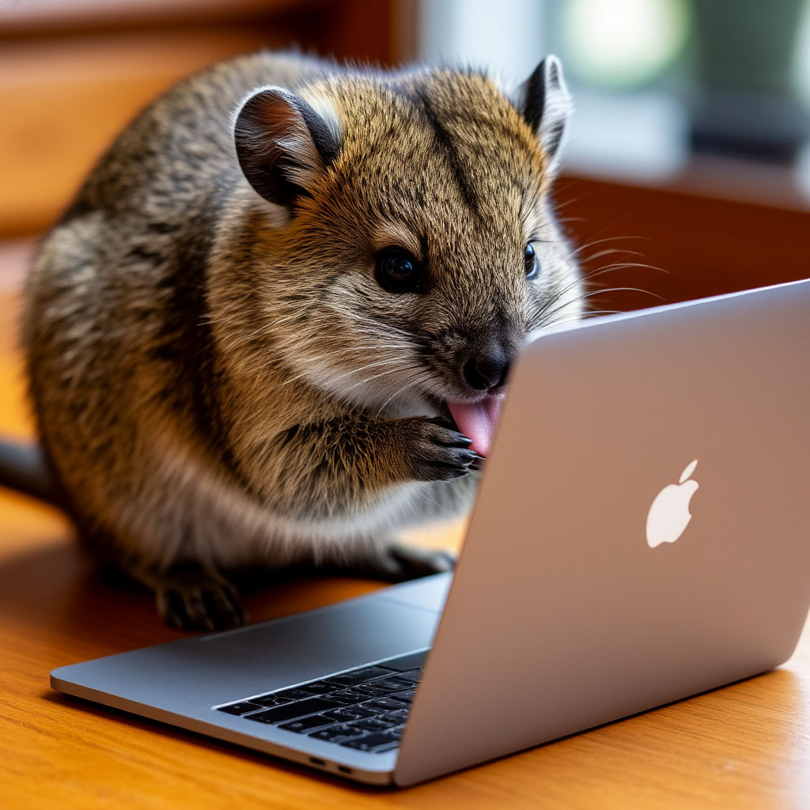

Meme Crawler — это парсер для сбора мемов с сайта mempack.ru. Проект не преследует коммерческих целей и демонстрирует возможности языка Python в получении и сохранении данных.

🚀 Быстрый старт
Установка
bash
## 1. Клонировать репозиторий
git clone https://github.com/yourusername/meme-crawler.git
cd meme-crawler

## 2. Создать виртуальное окружение
python -m venv mempack_env

## Активировать окружение
## Windows:
mempack_env\Scripts\activate
## Linux/Mac:
source mempack_env/bin/activate

## 3. Установить зависимости
pip install -r requirements.txt
Базовое использование
bash
## Запуск с настройками по умолчанию (50 страниц)
python main.py

## Быстрая демонстрация (3 страницы)
python main.py --test-mode

## Собрать определенное количество страниц
python main.py --pages 25

